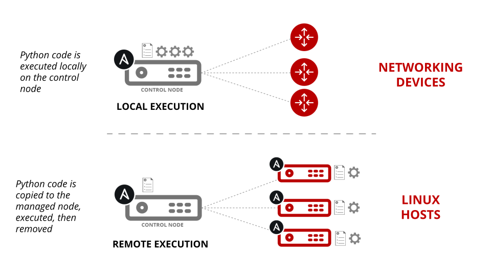

# Ansible for network configuration management

Ajay Chenampara

Twitter/Github : @termlen0

# Today's presentation

- An overview of Ansible

- Ansible for computer networks

- The Ansible plugin architecture

- How Ansible works

- Demos:

  1. Backing up IOS devices
  
  2. Configuring multiple devices 
  
  3. Using Ansible for dynamic documentation

# Overview

- Ansible: A brief history

- Why use Ansible:

  - Agentless
  
  - Batteries included
  
  - Jinja2 native integration

  
# Ansible for computer networks

- Challenges

- Network engineers are not programmers(!)

- Batteries included - for real!

- Powerful templating 

# The Ansible plugin architecture

# Ansible connectivity for networks

## The most important slide!!!

- Inventory

- Playbook

## The Ansible ecosystem

## The Ansible ecosystem

## The Ansible ecosystem

## The Ansible ecosystem

## The Ansible ecosystem

## The Ansible ecosystem

# Demos

## Backing up IOS devices

## Pushing configuration to multiple devices

## Generating an interface configuration report

